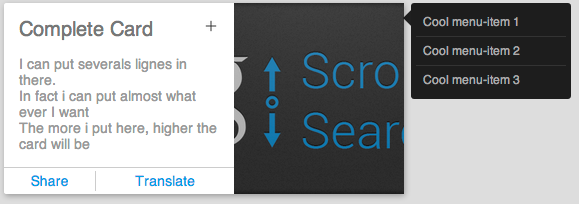

CardUICss
=========

This css file aims to reproduce the Card UI for web components.This UI is known as the new Google design on Android

Getting Started
===============

You can easily create a card or a set of card using the predefined classes used in this file.
First of all you will need to include the css file in your html:

<code> \<link rel="stylesheet" href="cardui.css"/\> </code>

You are now up and running Let's see how to build a card.

The most important element is the class: <code> card </code> It must be specified.
Inside this root element you can add 5 different other elements. Each one defined by it's own class

* title		: the title
* content	: the content
* media		: a picture / an image.
* menu		: an external menu, hidden by default.
* actions	: action buttons

Each of these elements can be used regardless of the others (exept for inline media. See the guidelines for further informations).

Besides there is some contextual classes that can be added aside [ ]  and/or inside { } the previous ones.

* inline	: specify if the element is displayed horizontally or vertically
* active	: specify if an element is active (visible)
* i			: This is not a class but the \<i\> tag. It adds an icon to the element

Summary
=======

* title { i }
* content
* media [ inline ] { img }
* menu
	 * menu-item { i }
* actions [ inline ]
	 * action { i }

Simple Example
==============
	

		
Simple Card\</div\>
		

			This is one of the most simple card you can create.
		

	

Menu Example
============
	

		
Menu Card

		

			This card has a menu hidden by default
		

	
		<ul class="menu">
			<li class="menu-item">Hey i'm a menu-item</li>
			<li class="menu-item">Hey i'm a menu-item</li>
			<li class="menu-item">Hey i'm a menu-item</li>
		</ul>
	

The card will have an external menu hidden by default.
You can trigger it by adding the class active to the menu (in Javascript for example):

	<ul class="menu active">

Media Example
=============
	

		
Media Card

		

			This card has a picture on it
		</div\>
	
		

	

In this case the picture will be displayed under the previous element.
You can add the picture in css like this:

	#my-pic{
		background-image: url(picture.png);
	}

Of course you can also insert the picture with an \ tag
	
	

		
	

	
But i recommand not to use this methods for 2 reasons:
1. this does not work with inline media
2. this will possibly stretch or shrink the original picture while using css background-image will nicely cover it

Inline media will put the picture to the right of the card. This is better for portrait oriented pictures.
For landscape oriented pictures I recommend the "normal" mode.

	

Also note that for better results you should always put **inline media (Inline Only)** at the end of the card element.
Otherwise it could break the entire design.

Actions Example
===============
	

		
Action Card

		

			This card has an action
		

		
		<ul class="actions">
			<li class="action">Click me !</li>
		</ul>
	

You can put multiple actions but if you do you should have nicer design with inline actions:

	<ul class="actions inline">
		<li class="action">Click me !</li>
		<li class="action">Action me !</li>
	</ul>

Also note that it's prettier to have actions at the bottom of the card.
That's why you should put this block at the end (except if combined with an inline media).

Icon Example
============
Icons can be assiociated with everything (i think) but i only tried them on action, menu-item and title

I will add predefined icon classes to easily chose an icon from a sprite but for now you will have to do it yourself
in your own css file.

HTML:

	

		<i class="search"></i>
		Iconic search title
	

CSS:

	i{ background-image: url(my-sprite.png); }
	i.search{ background-position: 0px 0px; }

You may have to re-specify the background-size beacause it"s set to 16px by default.

Complete Example
================

	<body>
		

			
<i onClick="toggleMenu()"></i>Complete Card

	
			

				
I can put severals lignes in there.

				
In fact I can put almost what ever I want

				
The more I put here, higher the card will be

			

	
			<ul id="my-menu" class="menu">
				<li class="menu-item">Cool menu-item 1</li>
				<li class="menu-item">Cool menu-item 2</li>
				<li class="menu-item">Cool menu-item 3</li>
			</ul>
	
			<ul class="actions inline">
				<li class="action"><i></i>Share</li>
				<li class="action"><i></i>Translate</li>
			</ul>
	
			

	
		

	
		
		
	</body>

GuideLines
==========

You can assemble the basic elements to get what you want but for aesthetic reasons you should follow theses rules:

* You gest better media results with the background-image css property than with the  tag
* Inline Media should always be at the end of the card markup
* Inline Media does not support  inside of it
* If you combine Media (normal) and Actions you should put the action markup at the end of the card
* If you does not want any title but still want a icon just write nothing in the title text

Licence
=======

There are no licence :P
Use this for what you want (yes yes even for commercial !!).
Just try to link to this repo whenever you can. I know some students won't but it's no big deal ;)

ENJOY !
